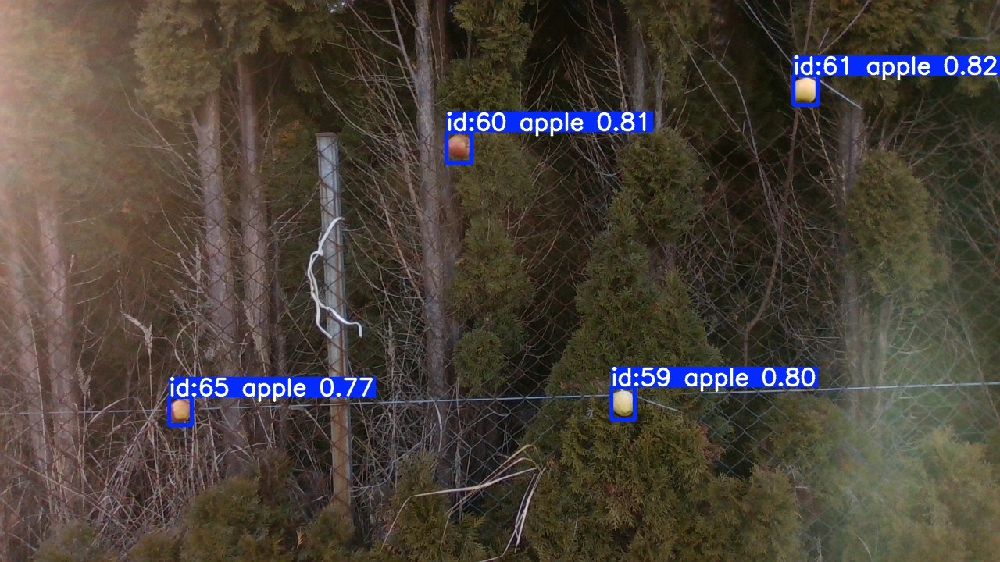

## Wizualizacje wybranych algorytmów śledzenia

### CSRT (ang. *Channel and Spatial Reliability*)
  
Opis: Wizualizacja działania algorytmu śledzenia obiektów CSRT.

### BotSort
  
Opis: Wizualizacja działania algorytmu śledzenia obiektów BotSort.

### Median Filter
  
Opis: Wizualizacja działania algorytmu śledzenia obiektów Median Filter.

### Zdjęcie drona
  
Opis: Zdjęcie drona użytego w projekcie.

### Zdjęcie poglądowe
  
Opis: Zdjęcie poglądowe przedstawiające arenę testową.
